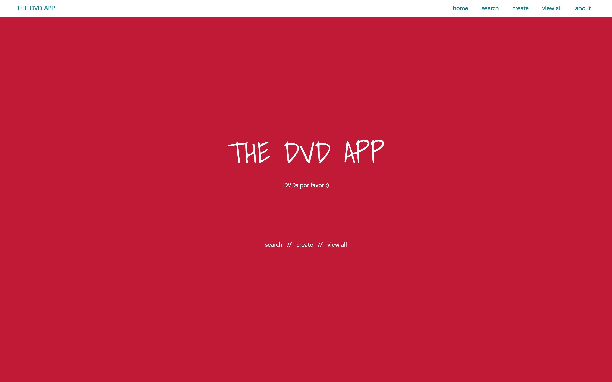
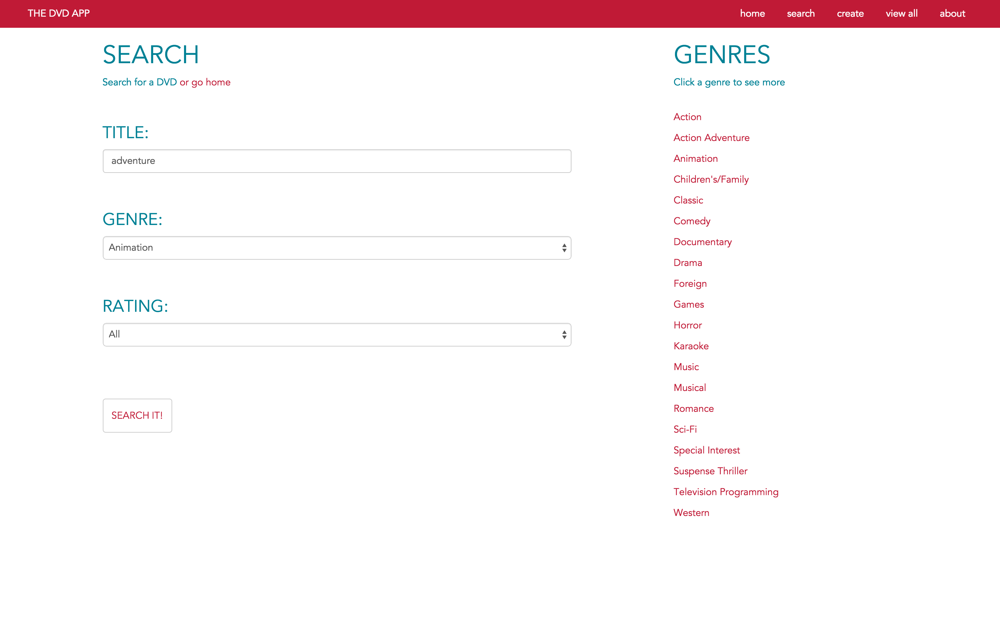
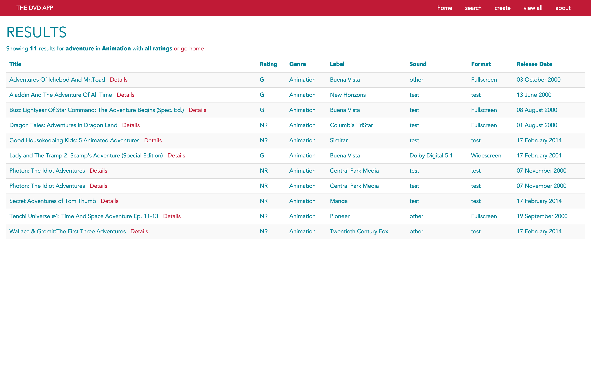
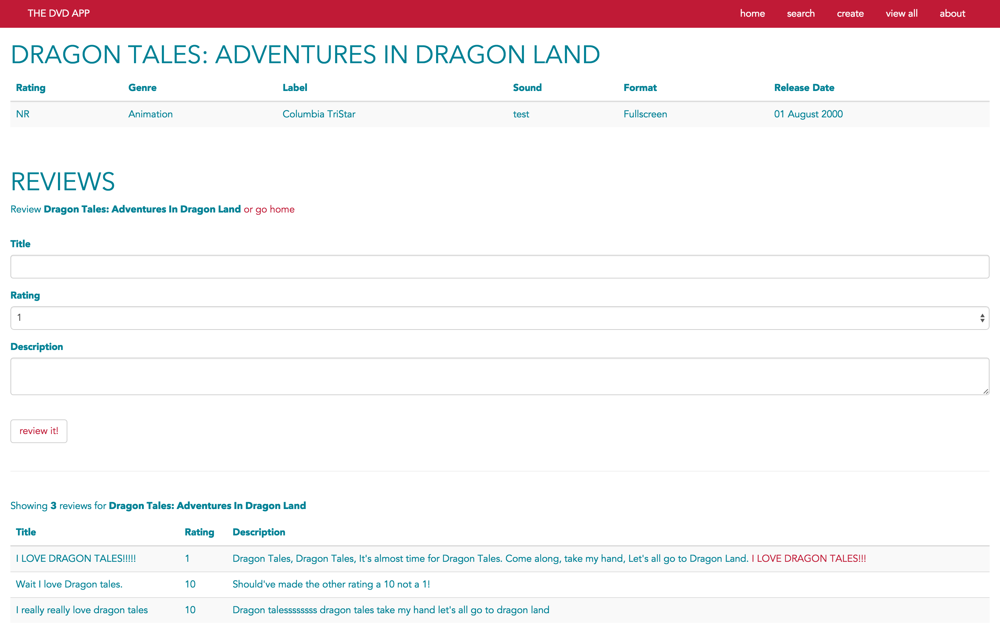
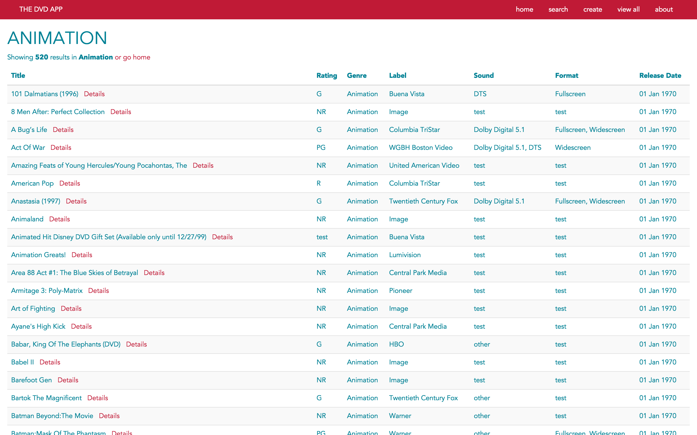
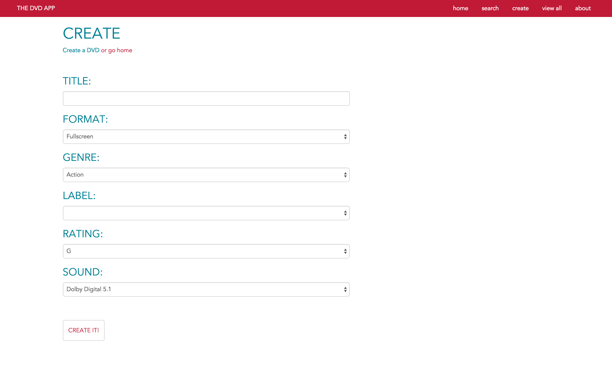

# itp405-spring2015-mvc

### The DVD App
DVDs por favor :)

### App Features
&mdash; view all dvds  
&mdash; search for dvds  
&mdash; view all genres  
&mdash; view all dvds in a genre  
&mdash; write reviews of dvds  
&mdash; view reviews of dvds  
&mdash; create dvds  
&mdash; view Rotten Tomato data

### Technologies Used
&mdash; Laravel / MVC  
&mdash; PHP / HTML / CSS  
&mdash; Bootstrap CSS  
&mdash; HTML forms  
&mdash; MySQL database  
&mdash; Blade templating  
&mdash; Eloquent ORM  
&mdash; Eager loading  
&mdash; Rotten Tomatoes API  
&mdash; Laravel's Cache class

### Screenshots

